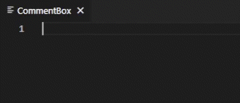
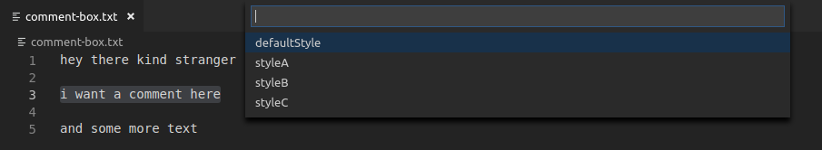

# Comment Box for Visual Studio Code

Add, remove and update pretty and highly configurable comment boxes in VS Code. The Comment Box extension adds new commands to VS Code that allow you to easily manage your comment boxes.



## Examples:
#### Adding a simple comment (with default settings)

```
my comment
```

turns into:

```
/**************
 * MY COMMENT *
 **************/
```


#### Adding a multiple line comment (with default settings)
```
could you
comment box this?
pretty please (*.*)
```
turns into:

```
/***********************
 *      COULD YOU      *
 *  COMMENT BOX THIS?  *
 * PRETTY PLEASE (*.*) *
 ***********************/
```


## Usage
Select the text that you want to comment, then call the command bar with:

`Ctrl+Shift+P`

And run the command:

`> Add Comment Box`

That's it. If you want to pick from one of many styles instead, run:

`> Add Comment Box Using Style`



Check the [Configuration section](#configuration) to learn how to add your own styles.

### Keybindings
You can bind these commands to a shortcut by adding something like this to your `keybindings.json`:
```
{ "key": "shift+alt+c", "command": "commentBox.add", "when": "editorTextFocus"},
{ "key": "shift+alt+z", "command": "commentBox.remove", "when": "editorTextFocus"},
{ "key": "shift+alt+x", "command": "commentBox.update", "when": "editorTextFocus"}
```

If you want to select a style:
```
{ "key": "shift+alt+c", "command": "commentBox.addUsingStyle", "when": "editorTextFocus"}
```

If you have multiple styles defined, you can make a keybind for each one like so:
```
{ 
    "key": "shift+alt+c", 
    "command": "commentBox.addUsingStyle", 
    "when": "editorTextFocus", 
    "args": "styleA"
},
{ 
    "key": "shift+alt+b", 
    "command": "commentBox.addUsingStyle", 
    "when": "editorTextFocus", 
    "args": "styleB"
}
```


## Configuration
If you have troubles with setting up the style you want, please fill an issue in the [GitHub Repository](https://github.com/SlySherZ/vscode-comment-box/issues).

Define your comment styles with the `commentBox.styles` setting:
```
"commentBox.styles": {
    "defaultStyle": {
        "capitalize": false,
        "ignoreInnerIndentation": false,
        "ignoreOuterIndentation": false,
        "removeEmptyLines": false,
        "textAlignment": "left"
    }
    "pythonicStyle": {
        "commentStartToken": "",
        "commentEndToken": "##",
        "leftEdgeToken": "# ",
        "rightEdgeToken": " #",
        "topEdgeToken": "#",
        "bottomEdgeToken": "#",
        "topRightToken": "##",
        "bottomLeftToken": "##"
    }
},
```

The `Add Comment Box` command always uses the `defaultStyle`.

### Style settings

Setting | Description
--- | ---
`capitalize` | Capitalizes the text inside the box.
`textAlignment` | Controls how the text should be aligned. Can be 'center' or 'left'.
`extendSelection` | When 'true' the whole line is replaced, not just the selected part.
`commentStartToken` | Characters that start a multi-line comment for your current language. This also defines the top left corner of the box.
`commentEndToken` | Characters that end a multi-line comment for your current language. This also defines the bottom right corner of the box.
`topRightToken` | Characters that are used to draw the top right corner of the box.
`bottomLeftToken` | Characters that are used to draw the bottom left corner of the box.
`topEdgeToken` | Characters that are used to draw top edge of the box. The entire top edge is skipped when this is set to an empty string.
`bottomEdgeToken` | Characters that are used to draw bottom edge of the box. The entire bottom edge is skipped when this is set to an empty string.
`leftEdgeToken` | Characters that are used to draw left edge of the box.
`rightEdgeToken` | Characters that are used to draw right edge of the box.
`boxWidth` | The width of the comment box. When set to 0, it will automatically pick the smallest possible value.
`fillingToken` | Characters that are used to fill the space between the text and the edges.
`removeEmptyLines` | When set to 'true', skips drawing lines that are empty.
`ignoreOuterIndentation` | When set to 'false', the box is placed in a way that matches the indentation of the text being commented. Works best when 'extendSelection' is enabled.
`ignoreInnerIndentation` | When set to 'false', the text inside the box will keep the same relative indentation between the lines. Requires `textAlignment` to be set to 'left'.


### Style examples

#### Don't mess with my text
```
    /**********************************************
     * try to:                                    *
     *    - preserve inner and outer indentation; *
     *    - preserve text CaSiNg;                 *
     *                                            *
     *    - and skipping lines is fine too;       *
     **********************************************/
```
settings.json:
```
"commentBox.styles": {
    "defaultStyle": {
        "capitalize": false,
        "ignoreInnerIndentation": false,
        "ignoreOuterIndentation": false,
        "removeEmptyLines": false,
        "textAlignment": "left"
    }
}
```

#### Pythonic style
```
##############################
#         THIS IS A          #
# MULTI-LINE COMMENT EXAMPLE #
##############################
```


settings.json: 
```
"commentBox.styles": {
    "defaultStyle": {
        "commentStartToken": "",
        "commentEndToken": "##",
        "leftEdgeToken": "# ",
        "rightEdgeToken": " #",
        "topEdgeToken": "#",
        "bottomEdgeToken": "#",
        "topRightToken": "##",
        "bottomLeftToken": "##",
    }
}
```

#### Just a left bar
```
/* Just a left bar
 * is enough.     
 */
 ```

settings.json: 
```
"commentBox.styles": {
    "defaultStyle": {
        "commentStartToken": "/* ",
        "commentEndToken": "\n */",
        "leftEdgeToken": " * ",
        "rightEdgeToken": "",
        "topEdgeToken": "",
        "bottomEdgeToken": "",
        "topRightToken": "",
        "bottomLeftToken": "",
        "capitalize": false,
        "textAlignment": "left"
    }
}
```


#### I Live on the Edge
```
/*==================+
 |I LIVE ON THE EDGE|
 |~-~-~-~SEE?~-~-~-~|
 +==================*/
 ```
 settings.json: 
```
"commentBox.styles": {
    "defaultStyle": {
        "commentStartToken": "/*",
        "commentEndToken": "*/",
        "leftEdgeToken": " |",
        "rightEdgeToken": "|",
        "topEdgeToken": "=",
        "bottomEdgeToken": "=",
        "topRightToken": "+",
        "bottomLeftToken": " +",
        "fillingToken": "~-"
    }
}
```
